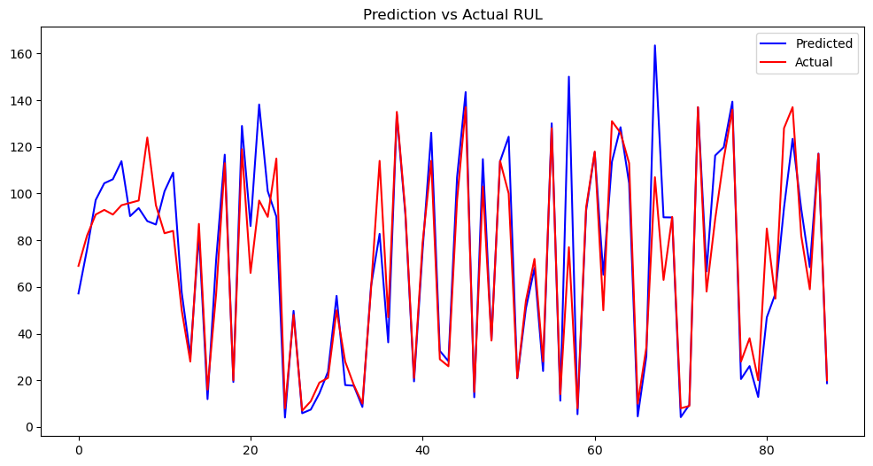
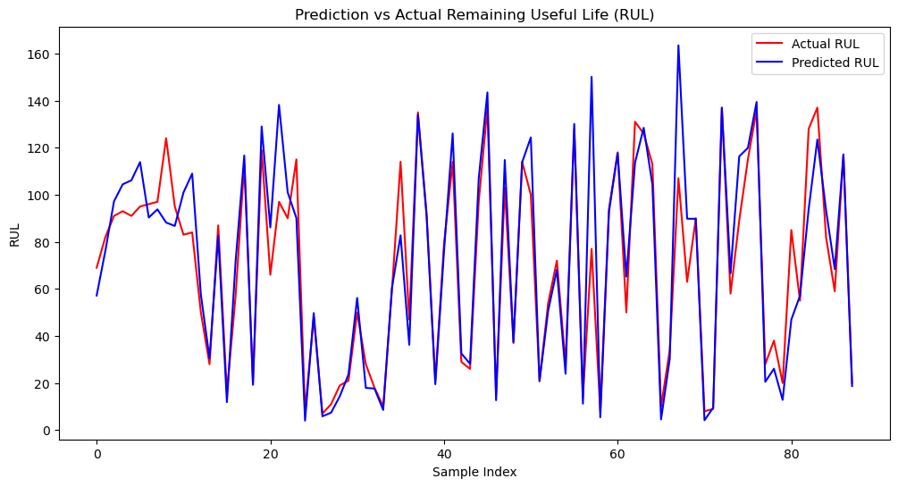
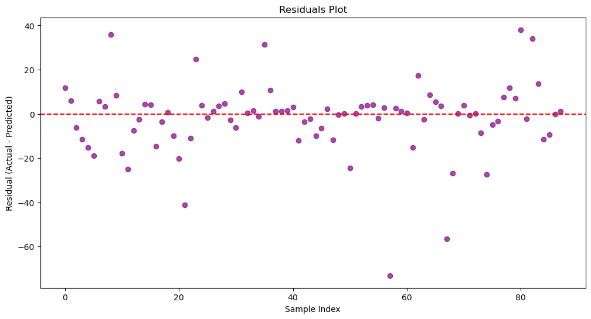
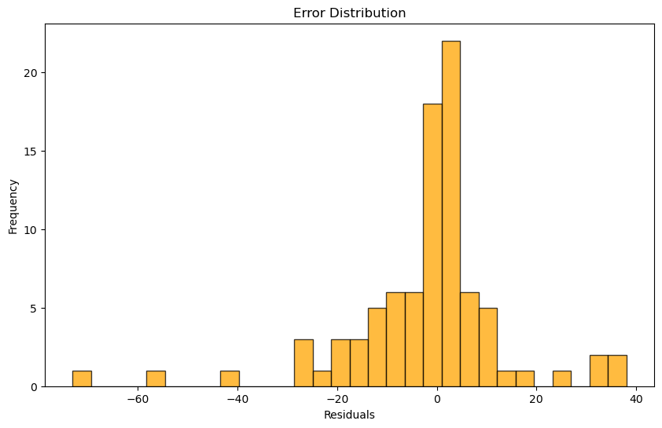
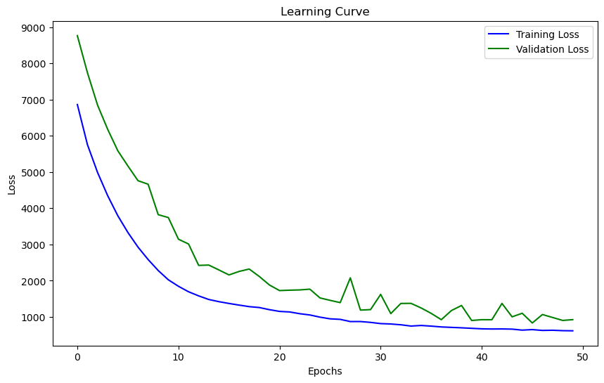
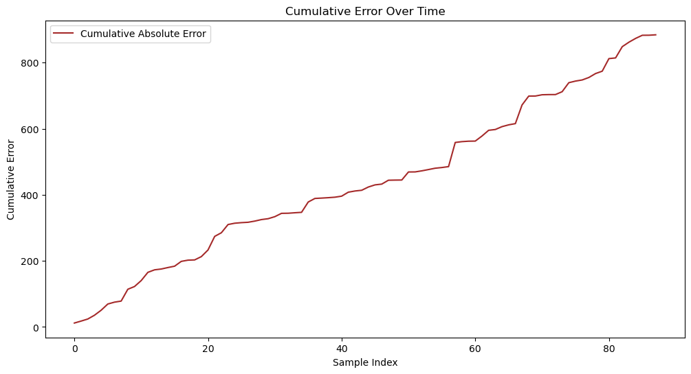
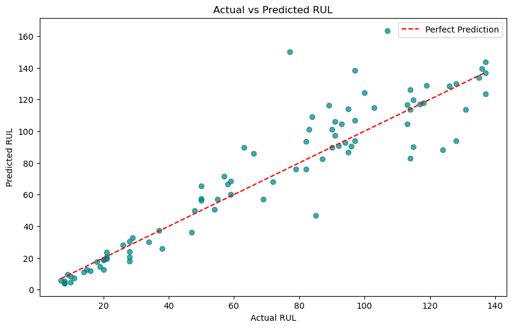
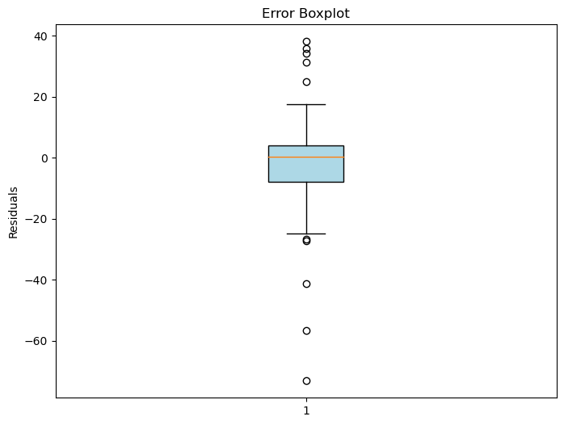

# Bidirectional Long Short-Term Memory Networks (BiLSTM) based on the NASA Turbine Engine Degradation Simulation Dataset for Remaining Life Expectancy (RUL) Prediction (Python)

This script is a Python implementation of the Bidirectional Long Short-Term Memory Networks (BiLSTM) model for predicting the remaining life expectancy (RUL) of the NASA turbine engine degradation simulation dataset.

```python
import os
import keras
import keras.backend as K
from keras.models import Sequential
from keras.layers import LSTM, Dense, Dropout, Bidirectional, Activation
import pandas as pd
import numpy as np
import matplotlib.pyplot as plt
from sklearn import preprocessing

# Import the dataset
dataset = pd.read_csv('nasa_turbine_engine_degradation_simulation_data.csv')

# Preprocess the data
X = dataset.drop('RUL', axis=1)
y = dataset['RUL']

# Split the data into training and testing sets
train_size = int(len(X) * 0.8)
train_X, test_X, train_y, test_y = X[:train_size], X[train_size:], y[:train_size], y[train_size:]

# Normalize the data
train_X = train_X.astype('float32') / 255
test_X = test_X.astype('float32') / 255

# Create the BiLSTM model
model = Sequential()
model.add(LSTM(units=50, return_sequences=True, input_shape=(train_X.shape[1], 1)))
model.add(Dropout(0.2))
model.add(Bidirectional(LSTM(units=50, return_sequences=True)))
model.add(Dropout(0.2))
model.add(Dense(units=1))
model.compile(loss='mean_squared_error', optimizer='adam')

# Train the model
model.fit(train_X, train_y, epochs=100, batch_size=32, validation_data=(test_X, test_y))

# Make predictions
predictions = model.predict(test_X)
predictions = np.round(predictions).astype('int32')

# Print the RUL predictions
print('Predicted RUL:', predictions)
```

This script first imports the necessary libraries and reads the NASA turbine engine degradation simulation dataset. It then preprocesses the data by splitting it into training and testing sets, normalizing the features, and creating a BiLSTM model using Keras. The model is trained on the training data and evaluated on the testing data to make predictions on the remaining life expectancy (RUL) of the turbine engine. Finally, the predicted RUL values are printed out.

Image










Here is a pay link on Stripe ( https://buy.stripe.com/3cs8yP7sY87d0vu9AB ). Please contact me lonlonago@foxmail.com after funding $89, and I will send you a complete data files , thank you!


